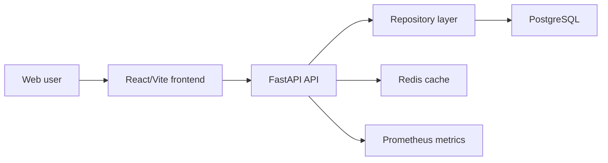

# Swinra Architecture

## MVP Shape

Swinra starts as a monorepo with a modular backend and a single React web client. This gives the team a working product surface before extracting microservices.

## Backend Domains

- Auth: registration, login and JWT access tokens.
- Profiles: user type, verification state, interests, fetishes and profile progress.
- Reputation: interaction ratings, average score, levels and badges.
- Matching: configurable minimum score plus profile filters.
- Community: forum posts, participation points and monthly ranking.
- Events: event creation and RSVP.
- Premium: most viewed couples, analytics, super scores and virtual gifts.

The current repository is in-memory for MVP speed. The route and service boundaries are already separated so SQLAlchemy repositories can replace it without changing frontend contracts.

## Frontend Domains

- Dashboard-first layout with reputation chart and profile completion.
- Matching filters for minimum score, user type and fetishes.
- Premium widget for "Pareja mas vista".
- Community and event summary lists.

## Production Notes

- Replace demo repository with SQLAlchemy/Alembic persistence.
- Add real payment provider for subscriptions and credits.
- Add document/social verification providers without storing raw document files in the application database.
- Put Cloudflare or an equivalent CDN/WAF in front of the ingress.
- Add `prometheus-fastapi-instrumentator` or OpenTelemetry before relying on dashboards.
